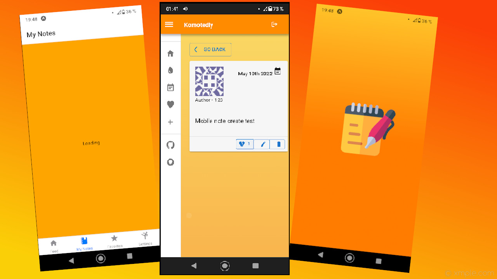

# Komotedly

### Example of 4x JS app - Full crossplatform access

## Web:

## Backend:

## Desktop:

## Mobile:

<h2>Todo:</h2>
<ul>
<li><strike><h3><b>Backend:</b></h3></strike>
<li><strike>'Me' query</strike>
</ul>

<ul>
<li><h3><b>Frontend:</b></h3>
<li><strike>Repository metrics</strike>
<li><strike>Responsive size for MUI icons</strike>
<li><strike>See current page location</strike>
<li><strike>Pagination</strike>
<li><strike> && echo ‘/* /index.html 200’ | cat >dist/_redirects</strike>
</ul>

<ul>
<li><h3><b>Desktop app:</b></h3>

<li><strike>Electron builder</strike>
<li><strike>hide menu bar</strike>
<li><strike>Crossplatform</strike>

</ul>

<ul>
<li><h3><b>Mobile app:</b></h3>
<li><strike>Android SDK</strike>
<li><strike>Simple interface</strike>
<li><strike>Google privacy police</strike>
</ul>
